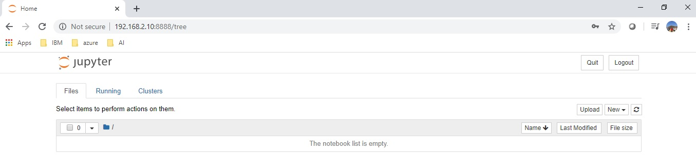

# jupyter by using docker

```bash
docker build . -t jupyter/notebook
```

```bash
docker run --rm -it -p 8888:8888 -v /home/burcu/jupyter/workdir:/home/jupyter jupyter/notebook
```

### Sample output

    To access the notebook, open this file in a browser:
        file:///home/jupyter/.local/share/jupyter/runtime/nbserver-1-open.html
    Or copy and paste one of these URLs:
        http://30ef30496c7c:8888/?token=4d31901ee88330760618ed42aa73209dcbf7cb608d78d3f1
    - or http://127.0.0.1:8888/?token=4d31901ee88330760618ed42aa73209dcbf7cb608d78d3f1



